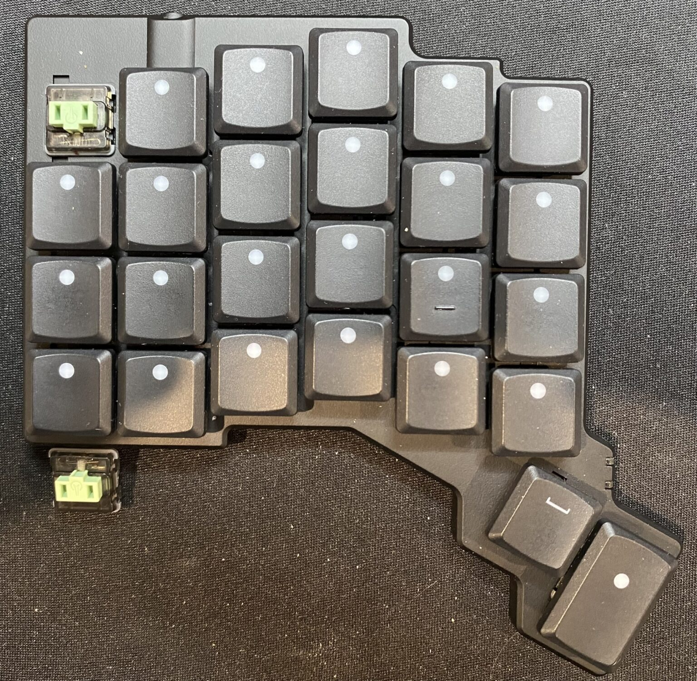

+++
title = "𐑯𐑿 ·𐑗𐑪𐑒 𐑕𐑢𐑦𐑗𐑩𐑟 𐑣𐑨𐑝 𐑼𐑲𐑝𐑛!"
featuredImage = "20240914-IMG_0442-1152x1536.jpg"
date = 2024-09-14
lastmod = 2025-03-02T17:32:41+11:00
tags = ["𐑒𐑩𐑥𐑐𐑿𐑑𐑼𐑟", "𐑒𐑰𐑚𐑹𐑛𐑟"]
categories = ["Blog"]
draft = false
weight = 3002
author = "Matt Maguire"
+++

𐑲 𐑣𐑨𐑝 𐑚𐑰𐑯 𐑮𐑰𐑤𐑦 𐑧𐑯𐑡𐑶𐑦𐑙 𐑞 ·𐑗𐑪𐑒 𐑮𐑧𐑛 𐑕𐑢𐑦𐑗𐑩𐑕 𐑞𐑨𐑑 𐑖𐑦𐑐𐑑 𐑢𐑦𐑞 𐑥𐑲 [#zsa-voyager-has-arrived][·𐑟𐑕𐑱 𐑝𐑶𐑩𐑡𐑼 𐑒𐑰𐑚𐑹𐑛]. 𐑲 𐑢𐑪𐑟 𐑣𐑬𐑢𐑧𐑝𐑼 𐑒𐑿𐑮𐑾𐑕 𐑣𐑬 𐑩 𐑤𐑲𐑑𐑼 𐑢𐑱𐑑 𐑕𐑢𐑦𐑗 𐑥𐑲𐑑 𐑓𐑰𐑤. 𐑲 𐑢𐑪𐑟 𐑒𐑪𐑯𐑕𐑦𐑛𐑼𐑦𐑙 𐑹𐑛𐑼𐑦𐑙 𐑕𐑳𐑥 ·𐑐𐑮𐑴 𐑮𐑧𐑛 35𐑜 𐑤𐑦𐑯𐑽 𐑕𐑢𐑦𐑗𐑩𐑟, 𐑚𐑳𐑑 𐑞𐑧𐑯 𐑲 𐑣𐑻𐑛 𐑩𐑚𐑬𐑑 𐑞 [·𐑒𐑱𐑤 𐑨𐑥𐑚𐑾𐑯𐑑𐑕](https://keebd.com/products/ambients-silent-linear-twilight-choc-switches)
𐑤𐑲𐑯 𐑝 𐑕𐑲𐑤𐑩𐑯𐑑 𐑤𐑦𐑯𐑽 𐑕𐑢𐑦𐑗𐑩𐑟 𐑯 𐑛𐑩𐑕𐑲𐑛𐑩𐑛 𐑑 𐑜𐑦𐑝 𐑞 ·𐑑𐑢𐑲𐑤𐑲𐑑 35𐑜 𐑕𐑢𐑦𐑗𐑩𐑟 𐑩 𐑑𐑮𐑲. 𐑪𐑯 𐑹𐑛𐑼𐑦𐑙 𐑞𐑧𐑥 𐑓𐑮𐑪𐑥 𐑩 𐑤𐑴𐑒𐑩𐑤 𐑝𐑧𐑯𐑛𐑼, 𐑞𐑱 𐑼𐑲𐑝𐑛 𐑩 𐑓𐑿 𐑛𐑱𐑟 𐑤𐑱𐑑𐑼, 𐑯 𐑪𐑯 𐑥𐑲 ·𐑝𐑶𐑩𐑡𐑼 𐑒𐑰𐑚𐑹𐑛 𐑲 𐑕𐑢𐑪𐑐𐑑 𐑬𐑑 𐑞 ·𐑗𐑪𐑒 𐑮𐑧𐑛𐑟 𐑓 𐑞 𐑨𐑥𐑚𐑾𐑯𐑑 𐑑𐑢𐑲𐑤𐑲𐑑𐑕.

𐑞𐑱 𐑛𐑵 𐑣𐑨𐑝 𐑩 𐑤𐑳𐑝𐑤𐑦 𐑓𐑰𐑤 𐑢𐑦𐑞 𐑞 𐑕𐑪𐑓𐑑 𐑒𐑫𐑖𐑩𐑯𐑦𐑙/𐑛𐑨𐑥𐑐𐑦𐑙 𐑨𐑑 𐑞 𐑧𐑯𐑛 𐑝 𐑞 𐑕𐑢𐑦𐑗𐑩𐑕 𐑑𐑮𐑨𐑝𐑩𐑤, 𐑷𐑤𐑞𐑴 𐑢𐑧𐑯 𐑑𐑲𐑐𐑦𐑙 𐑢𐑦𐑞 𐑞𐑧𐑥 𐑲 𐑓𐑧𐑤𐑑 𐑥𐑲 𐑧𐑮𐑼 𐑮𐑱𐑑 𐑒𐑮𐑰𐑐𐑦𐑙 𐑳𐑐. 𐑲 𐑓𐑬𐑯𐑛 𐑞𐑨𐑑 𐑢𐑦𐑞 𐑞 𐑕𐑪𐑓𐑑 𐑓𐑰𐑤 𐑝 𐑞 𐑕𐑢𐑦𐑗𐑩𐑕, 𐑲 𐑢𐑪𐑟 𐑐𐑮𐑧𐑕𐑦𐑙 𐑞𐑧𐑥 𐑩 𐑚𐑦𐑑 𐑥𐑹 𐑕𐑤𐑴𐑤𐑦 𐑯 𐑣e𐑟𐑦𐑑𐑩𐑯𐑑𐑤𐑦, 𐑢𐑦𐑗 𐑢𐑪𐑟 𐑒𐑷𐑟𐑦𐑙 𐑓𐑷𐑤𐑕 𐑨𐑒𐑑𐑦𐑝𐑱𐑖𐑩𐑯𐑟 𐑪𐑯 𐑥𐑲 𐑤𐑱𐑼-𐑑𐑨𐑐 𐑯 𐑥𐑪𐑛-𐑑𐑨𐑐 𐑒𐑰𐑟. 𐑕𐑴, 𐑲 𐑯𐑰𐑛 𐑑 𐑚𐑰 𐑩 𐑚𐑦𐑑 𐑥𐑹 𐑛𐑦𐑤𐑦𐑡𐑩𐑯𐑑 𐑩𐑚𐑬𐑑 "𐑑𐑨𐑐𐑦𐑙" 𐑮𐑭𐑞𐑼 𐑞𐑨𐑯 𐑐𐑮𐑧𐑕𐑦𐑙" 𐑞 𐑒𐑰𐑟. 𐑲 𐑭𐑤𐑕𐑴 𐑣𐑨𐑝 𐑯𐑪𐑑 𐑣𐑨𐑛 𐑩 𐑤𐑪𐑑 𐑝 𐑑𐑲𐑥 𐑓 𐑓𐑴𐑒𐑩𐑕𐑑 𐑑𐑲𐑐𐑦𐑙 𐑐𐑮𐑨𐑒𐑑𐑦𐑕 𐑤𐑱𐑑𐑤𐑦 𐑛𐑿 𐑑 𐑩 𐑕𐑤𐑲𐑑𐑤𐑦 𐑣𐑧𐑒𐑑𐑦𐑒 𐑖𐑧𐑡𐑵𐑤 𐑨𐑑 𐑢𐑻𐑒 𐑞𐑦𐑕 𐑑𐑲𐑥 𐑝 𐑘𐑽, 𐑯 𐑲𐑝 𐑕𐑰𐑯 𐑥𐑲 𐑑𐑲𐑐𐑦𐑙 𐑕𐑐𐑰𐑛 𐑛𐑮𐑪𐑐 𐑪𐑓 𐑩 𐑚𐑦𐑑. 𐑲𐑥 𐑖𐑫𐑼 𐑦𐑑 𐑢𐑴𐑯𐑑 𐑑𐑱𐑒 𐑤𐑪𐑙 𐑑 𐑜𐑧𐑑 𐑚𐑨𐑒 𐑑 𐑥𐑲 𐑐𐑮𐑰𐑝𐑾𐑕 𐑕𐑐𐑰𐑛.

𐑲 𐑛𐑩𐑕𐑲𐑛𐑩𐑛 𐑑 𐑐𐑪𐑐𐑘𐑩𐑤𐑱𐑑 𐑥𐑲 ·𐑒𐑹𐑯 \\(6 \times 3\\) 𐑒𐑰𐑚𐑹𐑛 𐑢𐑦𐑞 𐑞 ·𐑗𐑪𐑒 𐑮𐑧𐑛𐑟 𐑲 𐑮𐑰𐑥𐑵𐑝𐑛 𐑓𐑮𐑪𐑥 𐑥𐑲 ·𐑝𐑶𐑩𐑡𐑼. 𐑲 𐑮𐑰𐑥𐑵𐑝𐑛 𐑞 ·𐑗𐑪𐑒 𐑚𐑮𐑬𐑯𐑟, 𐑦𐑯𐑕𐑻𐑑𐑩𐑛 𐑞 ·𐑗𐑪𐑒 𐑮𐑧𐑛𐑟 𐑯 𐑮𐑩𐑐𐑤𐑱𐑕𐑑 𐑞 𐑒𐑰𐑒𐑨𐑐𐑕.



𐑦𐑯 𐑞 ·𐑒𐑹𐑯 𐑞 ·𐑗𐑪𐑒 𐑮𐑧𐑛𐑟 𐑛𐑴𐑯𐑑 𐑓𐑰𐑤 𐑒𐑢𐑲𐑑 𐑨𐑟 𐑯𐑲𐑕 𐑨𐑟 𐑢𐑧𐑯 𐑞𐑱 𐑢𐑻 𐑦𐑯 𐑞 ·𐑝𐑶𐑩𐑡𐑼 -- 𐑲 𐑐𐑫𐑑 𐑛𐑬𐑯 𐑑 𐑞 𐑥𐑹 𐑕𐑪𐑤𐑦𐑛 𐑒𐑪𐑯𐑕𐑑𐑮𐑳𐑒𐑖𐑩𐑯 𐑝 𐑞 ·𐑝𐑶𐑩𐑡𐑼. 𐑣𐑬𐑧𐑝𐑼, 𐑞 ·𐑗𐑪𐑒 𐑮𐑧𐑛𐑟 𐑦𐑯 𐑞 ·𐑒𐑹𐑯 𐑓𐑰𐑤 𐑥𐑳𐑗 𐑚𐑧𐑑𐑼 𐑞𐑨𐑯 𐑞 ·𐑗𐑪𐑒 𐑚𐑮𐑬𐑯𐑟 𐑞𐑱 𐑮𐑰𐑐𐑤𐑱𐑕𐑑, 𐑢𐑦𐑞 𐑤𐑧𐑕 𐑧𐑓𐑹𐑑 𐑮𐑰𐑒𐑢𐑲𐑼𐑛 (50𐑜 𐑝𐑻𐑕𐑩𐑟 60𐑜, 𐑯 𐑯𐑴 𐑕𐑒𐑮𐑨𐑗𐑦 "𐑑𐑨𐑒𐑑𐑲𐑤 𐑚𐑳𐑥𐑐" 𐑕𐑳𐑗 𐑨𐑟 𐑦𐑑 𐑦𐑟 𐑦𐑯 𐑞 𐑤𐑴 𐑐𐑮𐑴𐑓𐑲𐑤 ·𐑗𐑪𐑒 𐑕𐑢𐑦𐑗𐑩𐑟).

𐑦𐑯 𐑥𐑲 ·𐑒𐑹𐑯 \\(5 \times 3\\) 𐑒𐑰𐑚𐑹𐑛, 𐑲 𐑕𐑑𐑦𐑤 𐑣𐑨𐑝 𐑞 ·𐑗𐑪𐑒 𐑚𐑮𐑬𐑯 𐑕𐑢𐑦𐑗𐑩𐑟 𐑞𐑨𐑑 𐑞 𐑒𐑰𐑚𐑹𐑛 𐑖𐑦𐑐𐑑 𐑢𐑦𐑞.



𐑲 𐑔𐑦𐑙𐑒 𐑲𐑤 𐑩𐑝𐑧𐑯𐑗𐑩𐑤𐑦 𐑕𐑢𐑪𐑐 𐑞𐑧𐑥 𐑬𐑑 𐑓 𐑕𐑳𐑥 𐑕𐑐𐑺 ·𐑗𐑪𐑒 𐑮𐑧𐑛 𐑕𐑢𐑦𐑗𐑩𐑟 𐑞𐑨𐑑 𐑲 𐑹𐑛𐑼𐑛, 𐑚𐑳𐑑 𐑓 𐑯𐑬 𐑲𐑤 𐑤𐑰𐑝 𐑞 ·𐑗𐑪𐑒 𐑚𐑮𐑬𐑯𐑟 𐑦𐑯 𐑐𐑤𐑱𐑕 𐑕𐑴 𐑲 𐑣𐑨𐑝 𐑩 𐑚𐑱𐑕𐑤𐑲𐑯 𐑐𐑶𐑯𐑑 𐑝 𐑒𐑩𐑥𐑐𐑨𐑮𐑦𐑕𐑩𐑯.
